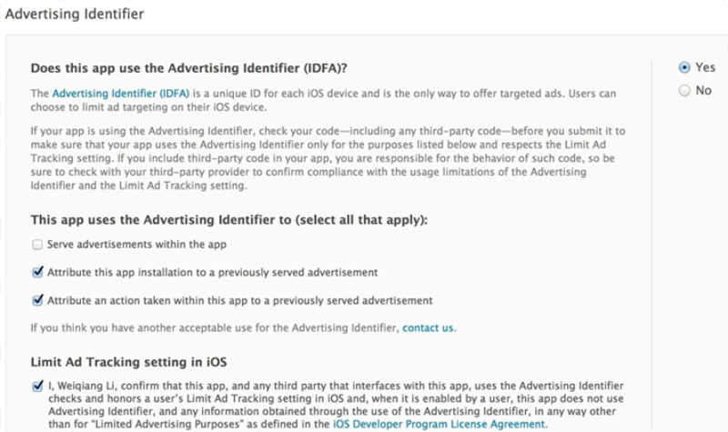

# iOS App发布流程

* 确认ZZConstant中debug静态常量；

* info.plist中需要更改的内容：
     1. Bundle version
     2. Bundle versions string, short
     
* IDFA检测：
     grep -r advertisingIdentifier .   （别少了最后那个点号）
     目前只有talking data在读取IDFA，友盟推送使用的是无IDFA版本（此命令会检测出来，友盟官方回复说没问题）
，app提审时需要勾选IDFA，具体参照：（还是有拒审风险）
http://doc.talkingdata.com/posts/55
 
 
* 最后打包，并确认打包好的ipa文件大小是否在合理范围内。

