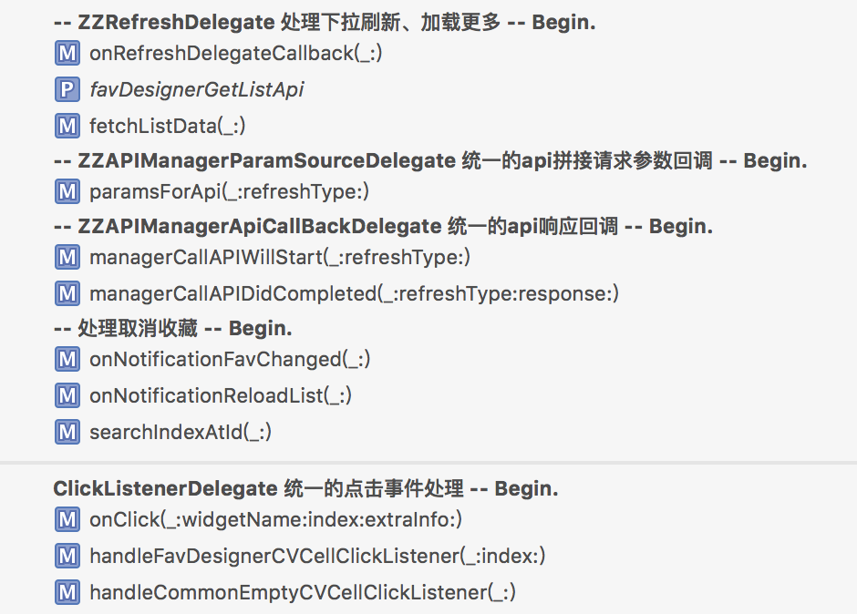

# 开发规范

###代码规范：
* xib中控件outlet命名：
		控件名简写_业务名
		例如：UIImageView：iv_share（分享图片）

		简写映射关系：
		UIImageView ---> iv
		UIButton    ---> btn
		UILabel		---> lb
		UITextView	---> tv
		UITableView ---> tav
		UICollectionView ---> cov
		NSLayoutConstraint ---> const
* 点击事件回调函数命名规则：
		on+控件名字+ClickListener
		onXXXClickListener
		例如：取消按钮点击事件：onCancellBtnClickListener
* 通知回调函数命名规则：
		onReceive+通知名字+Notification
		onReceiveXXXNotification
		例如：登录成功通知：onReceiveLoginSuccessNotification
* 一个函数中代码应尽量精简，不要出现大量空行等无意义内容；
* 每个函数，关键位置代码、成员变量添加注释，不要每个函数的注释前都加MARK，可以添加在关键函数中；
* 代码尽量遵循SOLID原则。
* ViewController中因为包含的逻辑较多，可使用分割线分割代码块；
```swift
 // ------------------------------------------------------------------------------------
    // MARK: -- ZZRefreshDelegate 处理下拉刷新、加载更多 -- Begin.
    // ------------------------------------------------------------------------------------
    
    func onRefreshDelegateCallback(refreshType: ZZRefreshType) ->Bool{
        zzlog("onRefreshDelegateCallback=====>\(refreshType)")
        fetchListData(refreshType)
        return true
    }
    
    private var favDesignerGetListApi: ZZApiManager?
    
    func fetchListData(refreshType: ZZRefreshType){
        favDesignerGetListApi = ZZDefaultApiManager(requestType: .ZZAPIManagerRequestTypeHttpGet
            , apiName: ZZConstant.API_FAV_LIST_DESIGNER_DESC, needLogin: true)
        favDesignerGetListApi!.setRequiredDelegate(self, apiCallBackDelegate: self)
        favDesignerGetListApi!.sendRequest(refreshType, page: getPageForRequest(refreshType))
    }
    
    // ------------------------------------------------------------------------------------
    // MARK: -- ZZAPIManagerParamSourceDelegate 统一的api拼接请求参数回调 -- Begin.
    // ------------------------------------------------------------------------------------
```

如下图所示，添加后可清楚查看到整个Controller包含的逻辑代码块及每个代码块中包含的函数；

 

* 每次修改代码加修改说明、复杂逻辑添加实现思路：
```swift
//
//  MainViewController.swift
//  zaozuo-ios
//
//  Created by xxx@zaozuo.com on 15/10/8.
//  Update by xxx@zaozuo.com on 16/05/13.
//  更新内容：
//  1. 重新整理代码，将大的函数拆分为多个小函数;
//  2. 处理滑动懒加载问题，滑动时去实例化vc，非一次性全部实例化;
//     懒加载实现思路：
//     2.1 在scrollViewDidScroll函数中必须区分用户点击tab还是滑动scrollview；
//     2.2 在scrollViewDidScroll函数中根据左右方向只加载下一个vc，
//         如果vc不存在添加到容器中，如果存在，因为tab数量等可能变化，必须重新设置vc frame
//  Copyright © 2015年 zaozuo. All rights reserved.
//
```

